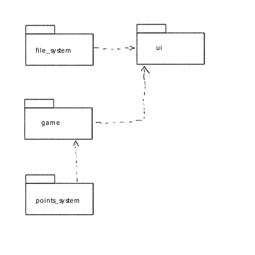
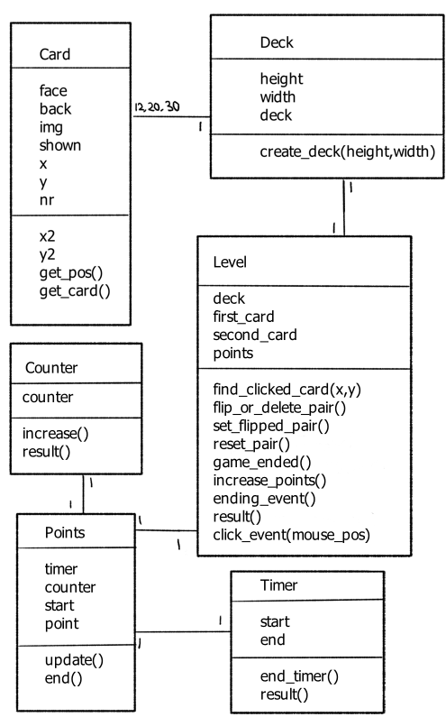
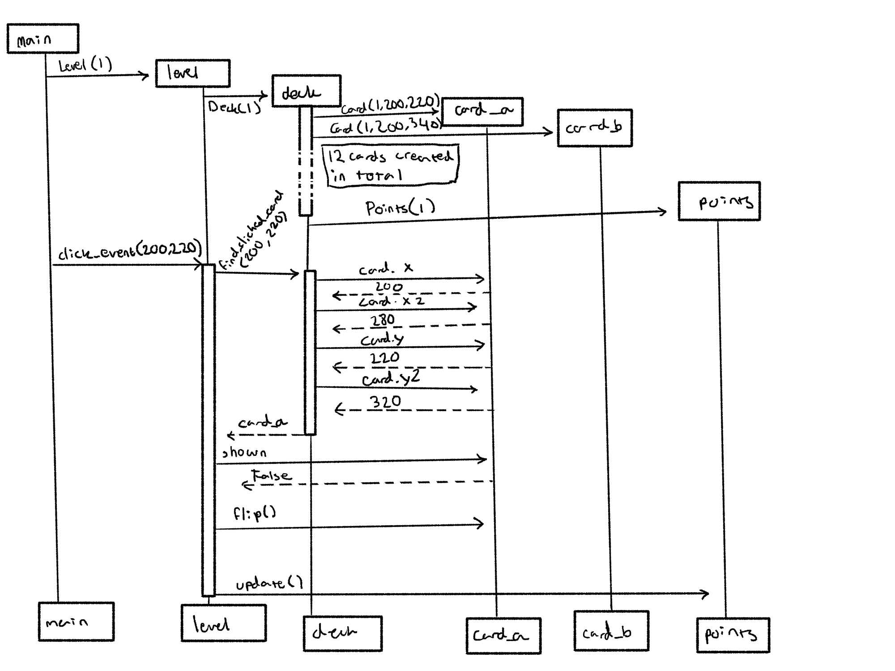

# Arkkitehtuuri

## Pakkausrakenne

Game: Itse peliin liittyviä luokat, logiikka.

ui: Käyttöliittymä ja valikoiden logiikka(?).

file_system: Tulostaulun tiedoston käsittely.

points_system: Pisteiden laskeminen.

---

## Käyttöliittymä

Käyttöliittymä voi näyttää pelin, päävalikko, ja "vaikeustaso" valikko. Valikot ovat molemmat Menu luokkia. Pelin näyttämiseen käyttöliittymä tarvitsee Level-luokan tiedot. Luokka LevelService on ainoa luokka joka kommunikoi Level-luokan ja muiden käyttöliittymän luokkien kanssa, ja muut käyttöliittymä-luokat kommunikoi tarvittaessa ainoastaan tämän kanssa Level-luokan sijaan.

## Pelin logiikka

### Peli

Kun käyttäjä painaa hiirennappia kutsutaan Level-luokan click_event-metodia. Ensin tutkitaan jos hiiren koordinaatit osuvat johonkin korttiin. Sitten tehdään tarvittavat toiminnot. 

### Pisteet

Pelissä on mukana Timer-luokka joka mittaa kuinka paljon aikaa on mennyt peliin. Counter-luokka laskee kuinka monta kertaa kortteja on käännetty.Pelin alussa käyttäjällä on tietty määrä pisteitä. Ajan kuluessa ja korttien kääntäessä käyttäjä menettää tietty määrä pisteitä. Vaikeustaso määrittää kuinka paljon pisteitä käyttäjä saa alussa, ja kuinka monta pisteitä käyttäjä voi menettää kerrallaan.

## Pisteiden tallennus

Ohjelma tallentaa parhaat tulokset csv tiedostoon. Save-luokka tutkii säännöllisesti jos tiedostossa on epärealistisia tuloksia tai virheitä. Jos näitä löytyy, koko tulostaulu nollataan kokonaan.

## Luokkakaavio

---

## Sekvenssikaavio, Level-luokan click_event():

---

## Parannettavaa

Jostain syystä käyttöliittymä määrää milloin tulostaulua päivitetään. 

Käyttöliittymän rakennetta voisi vielä parantaa.
