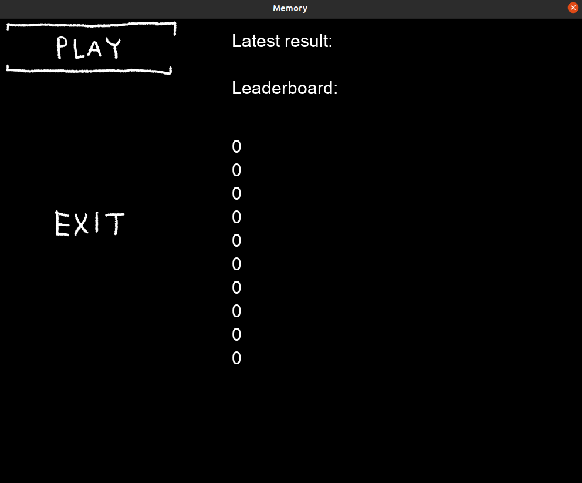

# Käyttöohje

1. Lataa release. Pura zip.

2. Suorita komentorivillä: 

```bash
poetry install 
```

3. Käynnistä ohjelma komennolla: 

``` bash
poetry run invoke start
```

---


## Peli

### 1.



Käytä hiirtä. Paina play-nappia aloittaaksesi uuden pelin.

---

### 2.


Valitse sopivan vaikeustason. 

---

### 3.


Klikkaa kortteja kääntääksesi niitä.

---

### 4.


Löydä kaikki parit voittaaksesi pelin! Menetät pisteitä jos teet virheitä. Ajan kuluessa menetät myös pisteitä. 

Vaikeimmalla tasolla sinulla on mahdollisuus saada eniten pisteitä, mutta virheistä sakotetaan myös eniten pisteitä.

---

### 5.


Kun peli on loppu näet viimeisimmän pistemäärän. Parhaat tulokset tallentuvat tulostauluun.
