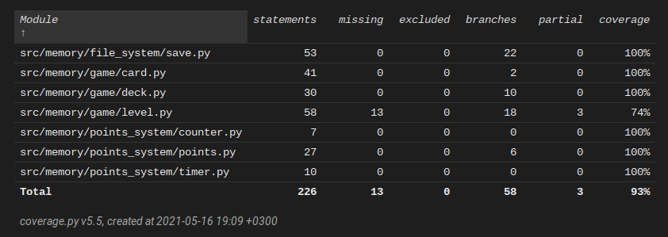

# Testausdokumentti

Sovelluksen automatisoituun testaamiseen on käytetty unittest. Kaikki paitsi käyttöliittymän luokat ovat testattu tällä tavalla. Sovellusta on myös testattu manuaalisesti. 

## Automatisoidut testit

### Tulostaulun testaus

Tulostaulun testit luovat tiedostoja jotka vastaavat kelvollisia ja epäkelvollisia totuustauluja, ja testaa näillä Save-luokkaa. Näin oikeaa ohjelman käyttämä totuustaulu ei muutu.

### Pelin logiikka

Pelin logiikka tapahtuu Level-luokassa. Sille ei ole tehty testejä missä peli pelataan loppuun, koska en ole vielä keksinyt järkevää tapaa toteuttaa sellaista testiä.

Level-luokan testit jotka testaavat pisteiden laskua eivät aina mene läpi jos kone on liian hidas. Esimerkiksi on olemassa seuraava tapaus: Testi jonka tarkoitus on huomioida vain klikkauksien pistevähennykset ei mene läpi koska ajan kulku vie myös pisteitä pois.

### Testauskattavuus

Haarautumiskattavuus on 93%.

## Järjestelmätestaus

Sovellusta on testattu Linux- ja Windows-ympäristössä. Kaikki [määrittelydokumentissa](https://github.com/000hcl/ot-harjoitustyo/blob/master/dokumentaatio/vaatimusmaarittely.md) listatut toiminnallisuudet on testattu ja toimivat molemmissa ympäristöissä.
